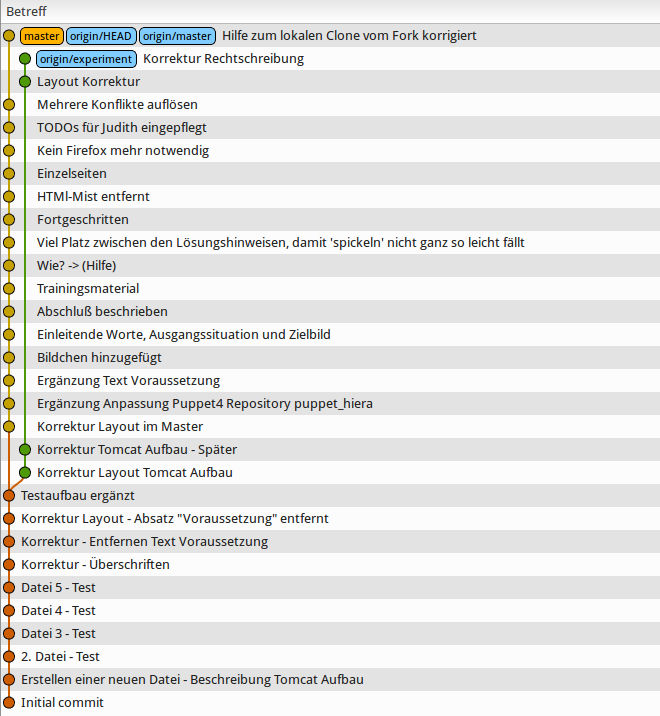
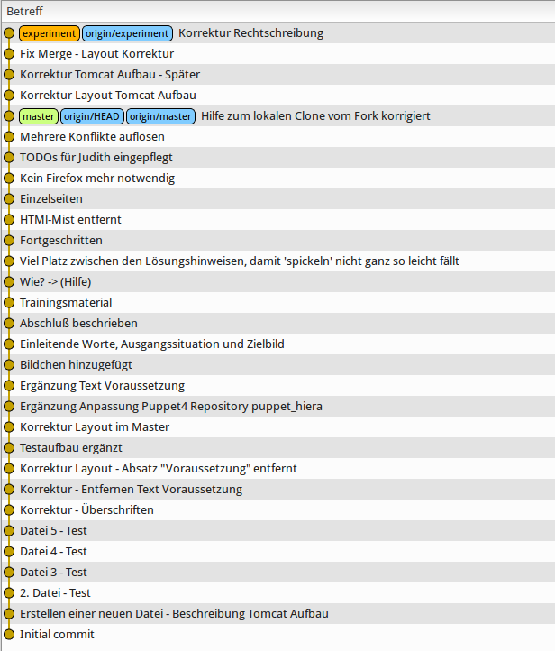

Training: Git-Rebase (fortgeschritten)
======================================

Bitte führe dieses Training erst durch, wenn die
"Git-Rebase (grundlegend)" durchgeführt hast!
Die Ausgangssituation und das Zielbild sind
identisch zum Basistraining!

Das Training ist intern und extern verfügbar.
Die externe URL ist: [github:git-rebase-training-advanced](https://github.com/70435-training/git-rebase-training-advanced).

Voraussetzungen
---------------

Seitens der "Infrastruktur" gibt es diese Voraussetzungen:

* Firefox ist installiert (Chrome geht nicht)
* Git-Kommandozeilen-Tools sind installiert
* Meld ist installiert [(Hilfe)](cheat-sheet/0890.md)
* Gitg ist installiert [(Hilfe)](cheat-sheet/0900.md)
* Fork von diesem Repo ist angelegt, Arbeit erfolgt nur an
  diesem Fork
* Du hast einen lokalen Clone vom Fork [(Hilfe)](cheat-sheet/0910.md)
* Dein Arbeitsverzeichnis ist im lokalen Clone
* Diese Anleitung kann in Firefox gesichtet werden: `firefox index.html`

Seitens der Kenntnisse:

* Erfahrung mit der Kommandozeile
* Erfahrung mit Git (clone, branch, pull/push, commit, ...)
* [Training: Git-Rebase (grundlegend)](https://github.com/70435-training/git-rebase-training-basic) ist durchgeführt

Ausgangsituation
----------------

Die Ausgangssituation ist quasi identisch zum Basistraining:

- Es gibt einen Master-Branch
- ... und auch den Branch "experiment"
- "experiment" wurde irgendwann in der Vergangenheit erzeugt,
  er zweigt in der Vergangenheit vom Master-Branch ab
- Die Ausgangssituation kannst Du visualisieren mit `gitg origin/master origin/experiment`

Zielbild
--------

Das Zielbild ist quasi identisch zum Basistraining:

- Es gibt einen Master-Branch
- ... und auch den Branch "experiment"
- Der Abzweigezeitpunkt von "expriment" ist verschoben
  auf den aktuellen Master-Branch

Ablauf
------

### Vorbereitungen

- Stelle sicher, dass alle Änderungen am zentralen Repo bei Dir lokal verfügbar sind [(Hilfe)](cheat-sheet/1010.md)
- Visualisiere die Situation [(Hilfe)](cheat-sheet/1020.md)
- Kontrolliere, ob "master" und "origin/master" übereinstimmen!
- Kontrolliere, ob "experiment" und "origin/experiment" übereinstimmen!

### Durchführung

- Branch "experiment" auschecken [(Hilfe)](cheat-sheet/1110.md)
- Branch "experiment" aktualisieren [(Hilfe)](cheat-sheet/1120.md)
- Rebase durchführen [(Hilfe)](cheat-sheet/1135.md)
- Sichten [(Hilfe)](cheat-sheet/1140.md)
- Ergebnis "veröffentlichen" [(Hilfe)](cheat-sheet/1150.md)

Nachkontrolle
-------------

- Visualisiere die Situation [(Hilfe)](cheat-sheet/1210.md)
- Kontrolliere, ob "master" und "origin/master" übereinstimmen!
- Kontrolliere, ob "experiment" und "origin/experiment" übereinstimmen!
- Vergleiche Dein Bild strukturell mit [images/final.png](images/final.png)

Abschluß
--------

Nach Abschluß des Trainings bitte die URL zu dem bearbeiteten
Fork per Email schicken an "dp-training@daemons-point.com"!
