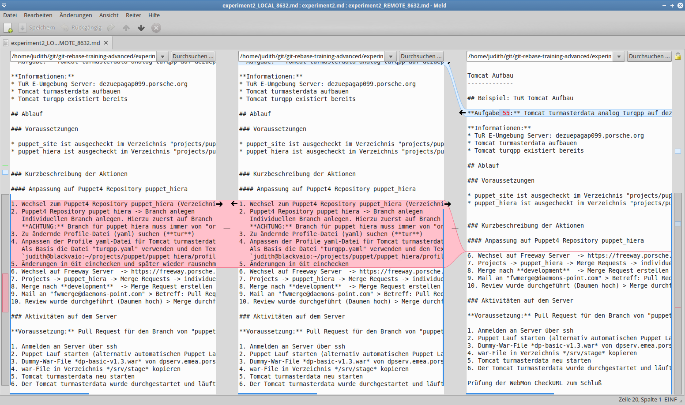
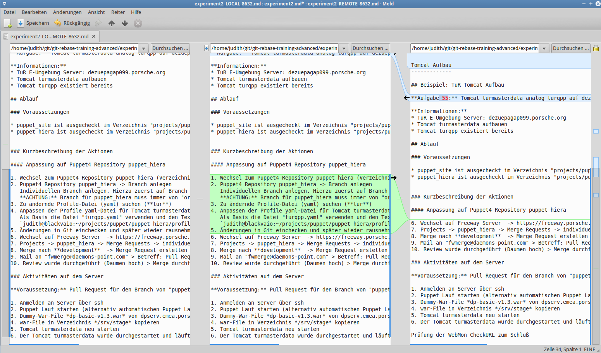

#### 1135

Rebase durchführen

```
$ git rebase master
automatischer Merge von experiment2.md
KONFLIKT (Inhalt): Merge-Konflikt in experiment2.md
error: Konnte de7ac41... (Layout Korrektur) nicht anwenden
Resolve all conflicts manually, mark them as resolved with
"git add/rm <conflicted_files>", then run "git rebase --continue".
You can instead skip this commit: run "git rebase --skip".
To abort and get back to the state before "git rebase", run "git rebase --abort".
Konnte de7ac41... (Layout Korrektur) nicht anwenden
```


```
$ git status
interaktives Rebase im Gange; auf 070181d
Zuletzt ausgeführte Befehle (3 Befehle ausgeführt):
   pick b6e6f3a Korrektur Tomcat Aufbau - Später
   pick de7ac41 Layout Korrektur
  (mehr Informationen in Datei .git/rebase-merge/done)
Nächster auszuführender Befehl (1 Befehle verbleibend):
   pick 43705dc Korrektur Rechtschreibung
  (benutzen Sie "git rebase --edit-todo" zum Ansehen und Bearbeiten)
Sie sind gerade beim Rebase von Branch 'experiment' auf '070181d'.
  (beheben Sie die Konflikte und führen Sie dann "git rebase --continue" aus)
  (benutzen Sie "git rebase --skip", um diesen Patch auszulassen)
  (benutzen Sie "git rebase --abort", um den ursprünglichen Branch auszuchecken)

Nicht zusammengeführte Pfade:
  (benutzen Sie "git restore --staged <Datei>..." zum Entfernen aus der Staging-Area)
  (benutzen Sie "git add/rm <Datei>...", um die Auflösung zu markieren)
	von beiden geändert:    experiment2.md

keine Änderungen zum Commit vorgemerkt (benutzen Sie "git add" und/oder "git commit -a")
```   

Auflösen der Konflikte mit `$ git mergetool` -> meld

```
$ git mergetool

This message is displayed because 'merge.tool' is not configured.
See 'git mergetool --tool-help' or 'git help config' for more details.
'git mergetool' will now attempt to use one of the following tools:
opendiff kdiff3 tkdiff xxdiff meld tortoisemerge gvimdiff diffuse diffmerge ecmerge p4merge araxis bc codecompare smerge emerge vimdiff
Merging:
experiment2.md

Normal merge conflict for 'experiment2.md':
  {local}: modified file
  {remote}: modified file
Hit return to start merge resolution tool (meld): 
experiment2.md seems unchanged.
Was the merge successful [y/n]? y

```

  

Innerhalb von "meld": Beim "roten Block" auf den Pfeil zwischen linker Spalte und Mitte drücken. 


  


Der Konflikt wurde aufgelöst.   
Menü "Datei > Speichern" oder direkt Icon "Speichern".     
Beenden     


`$ git status` -> Meldung, es dürfen keine Konflikte mehr angezeigt werden!

```
$ git status
interaktives Rebase im Gange; auf 070181d
Zuletzt ausgeführte Befehle (3 Befehle ausgeführt):
   pick b6e6f3a Korrektur Tomcat Aufbau - Später
   pick de7ac41 Layout Korrektur
  (mehr Informationen in Datei .git/rebase-merge/done)
Nächster auszuführender Befehl (1 Befehle verbleibend):
   pick 43705dc Korrektur Rechtschreibung
  (benutzen Sie "git rebase --edit-todo" zum Ansehen und Bearbeiten)
Sie sind gerade beim Rebase von Branch 'experiment' auf '070181d'.
  (alle Konflikte behoben: führen Sie "git rebase --continue" aus)

Zum Commit vorgemerkte Änderungen:
  (benutzen Sie "git restore --staged <Datei>..." zum Entfernen aus der Staging-Area)
	geändert:       experiment2.md

Unversionierte Dateien:
  (benutzen Sie "git add <Datei>...", um die Änderungen zum Commit vorzumerken)
	experiment2.md.orig

```
Und weiter mit `$ git rebase --continue`

```
$ git rebase --continue
Hinweis: Warte auf das Schließen der Datei durch Ihren Editor... Bearbeite '/etc/joe/editorrc'...Bearbeite '/etc/joe/ftyperc'...fertig
fertig

~/git/git-rebase-training-advanced/.git/COMMIT  Row 1    Col 19   2:11  Ctrl-K H for help
Fix Merge - Layout Korrektur                    

# Bitte geben Sie eine Commit-Beschreibung für Ihre Änderungen ein. Zeilen,
# die mit '#' beginnen, werden ignoriert, und eine leere Beschreibung
# bricht den Commit ab.
#
# Autor:           Judith Platzer <judith.platzer+gitbucket@daemons-point.com>
#
# interaktives Rebase im Gange; auf 070181d
# Zuletzt ausgeführte Befehle (3 Befehle ausgeführt):
#    pick b6e6f3a Korrektur Tomcat Aufbau - Später
#    pick de7ac41 Layout Korrektur
# Nächster auszuführender Befehl (1 Befehle verbleibend):
#    pick 43705dc Korrektur Rechtschreibung
# Sie sind gerade beim Rebase von Branch 'experiment' auf '070181d'.
#
# Zum Commit vorgemerkte Änderungen:
#       geändert:       experiment2.md
#
# Unversionierte Dateien:
#       experiment2.md.orig
#

Datei /home/judith/git/git-rebase-training-advanced/.git/COMMIT_EDITMSG gespeichert
[losgelöster HEAD 23f9bf7] Fix Merge - Layout Korrektur
 Author: Judith Platzer <judith.platzer+gitbucket@daemons-point.com>
 1 file changed, 5 insertions(+), 3 deletions(-)
Successfully rebased and updated refs/heads/experiment.

```